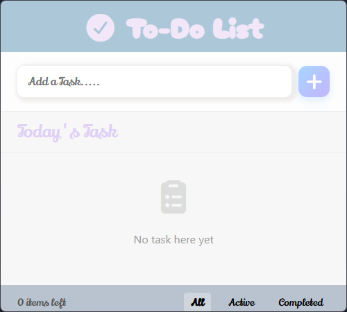
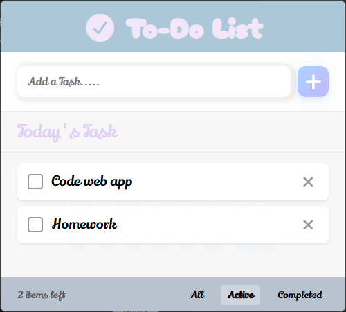
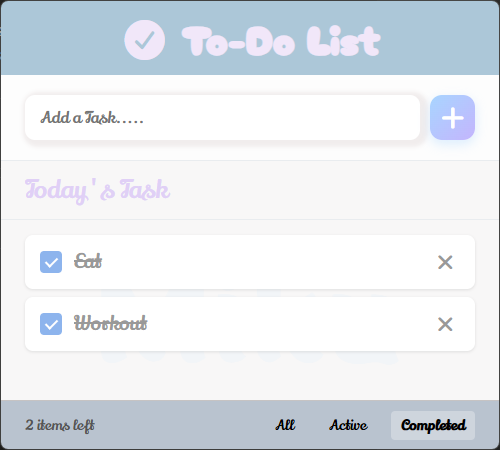

# To-Do List

A clean and minimal to-do list application built with Electron for desktop use, with full web browser support.

## Screenshots

### Empty State


### Active Tasks


### Completed Tasks


## Features

- Add new tasks
- Mark tasks as complete
- Delete tasks
- Filter tasks by status (All, Active, Completed)
- Task counter showing remaining items
- Persistent storage using localStorage
- Responsive design with custom styling
- Cross-platform desktop app (Windows, macOS, Linux)
- Can also run directly in web browsers

## Technologies Used

- Electron - Desktop application framework
- HTML5
- CSS3
- JavaScript (ES6+)
- Font Awesome icons
- Google Fonts

## Getting Started

### Desktop Application

#### Installation

1. Clone the repository
```bash
git clone https://github.com/DebL0g/To-Do-list.git
```

2. Navigate to the project directory
```bash
cd To-Do-list
```

3. Install dependencies
```bash
npm install
```

4. Run the application
```bash
npm start
```

### Web Browser Version

Simply open `index.html` in your web browser. No installation required.

## Usage

### Adding a Task
- Type your task in the input field
- Click the plus button or press Enter to add the task

### Managing Tasks
- Click the checkbox to mark a task as complete
- Click the X button to delete a task
- Use the filter buttons at the bottom to view All, Active, or Completed tasks

### Data Persistence
All tasks are automatically saved to your browser's localStorage, so your tasks will persist even after closing the browser.

## Building for Distribution

To package the application for distribution:

```bash
npm run build
```

This will create distributable packages for your current platform.

## File Structure

```
To-Do-list/
├── index.html          # Main HTML file
├── style.css           # Styles and layout
├── list.js             # Application logic
├── main.js             # Electron main process
├── package.json        # Node dependencies and scripts
├── package-lock.json   # Dependency lock file
└── README.md           # Documentation
```

## Requirements

### Desktop App
- Node.js (v14 or higher recommended)
- npm

### Web Browser
Works on all modern browsers that support:
- ES6 JavaScript
- localStorage API
- CSS3 features

## License

This project is open source and available under the MIT License.

## Author

DebL0g

## Contributing

Contributions, issues, and feature requests are welcome. Feel free to check the issues page if you want to contribute.
